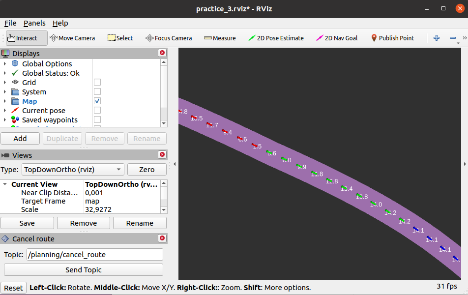
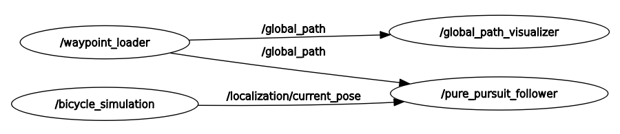
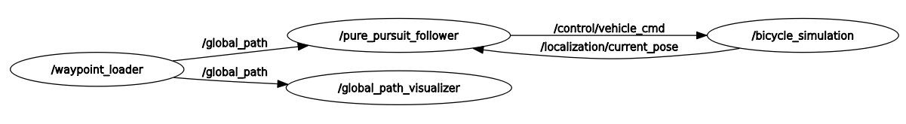
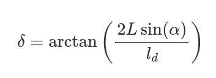
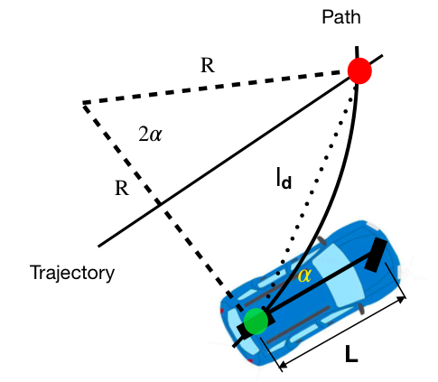

[< Previous practice](../practice_2) -- [**Main Readme**](../README.md) -- [Next practice >](../practice_4/)

# Practice 3 - Controller

In this practice, we will implement a simple path following an algorithm (controller) called Pure Pursuit. Path following is about staying on the path as accurately as possible while driving the car. The only way we can control the vehicle is through the steering angle and speed. Your task is to implement the Pure Pursuit algorithm that produces the steering angles to keep the car on the path. To simplify things, velocities will be taken from the recorded path.

Output from your node (steering angle and speed) will go into the `bicycle_simulation` node (that is given). It will then, based on the vehicle's current position and commands from your controller node, calculate and update where the vehicle will be in the next time step and what is its speed and orientation.

More about Pure Pursuit:
* [Three methods of lateral control](https://www.shuffleai.blog/blog/Three_Methods_of_Vehicle_Lateral_Control.html)
* [Pure Pursuit](https://thomasfermi.github.io/Algorithms-for-Automated-Driving/Control/PurePursuit.html)

#### Additional files provided
* The following nodes are added:
   - `waypoint_loader` - loads waypoints and publishes them as a path
   - `global_path_visualizer` - visualizes the path
   - `bicycle_simulation` - simulates the vehicle movement using a simple bicycle model
* Added configuration files
   - `planning.yaml` - some of the parameters for `waypoint_loader` are taken from that file
   - `vehicle.yaml` - necessary parameters for `bicycle_simulator`


### Expected outcome
* Understanding about the general task of vehicle's lateral control
* The car is able to follow the recorded waypoints (path) from practice_2. Theoretically, the same simple controller could be used with a real car.


## 1. Preparation

1. Copy your localizer node from the previous practice to your new practice_3 package under the `/nodes/localizer`
2. As areminder let us build the workspace. It is not necessary here, since we are adding a python node that does not need building. If we would be using code in C or C++ then after including the source code of the new node we would need to build the workspace and source it.
3. Go to catkin_ws folder: `cd ~/autoware_mini_practice`
4. Optional: `catkin clean` - will clean te workspace. Removes `build` and `devel` folders if you allow it. Suggested when nodes are removed or replaced, but again it is crucial when we are dealing with code that needs to be built. It is not the case with Python code, so we can see the code changes affecting the behaviour already without rebuilding the workspace.
5. Optional: `catkin init` - if for some reason `catkin clean` reports an error and the workspace is not properly initialized
6. Build workspace: `catkin_make`
7. Source your workspace: `source devel/setup.bash`

##### Validation
* If you don't want to overwrite your waypoints file from the previous practice, then run `roslaunch practice_3 practice_2.launch` with the additional argument `waypoints_file:=your_custom_file_name.csv`
   - should work as in previous practice - records a waypoint file
* run `roslaunch practice_3 practice_3.launch`
   - should load the waypoints (make sure to use the existing file name) and visualize them in rviz (path with waypoints, blinker infromation and speed values at the waypoints)




## 2. Create a path follower node

After running `roslaunch practice_3 practice_3.launch`, we saw waypoints loaded and visualized in rviz. We can call this array of waypoints a global path, and that is what we want to follow with the car. In this task, we will create a "skeleton" of that node.

##### Instructions
1. Create node `pure_pursuit_follower.py` under `/nodes/control`
2. Organize the node within the class structure - see the code example below and also from previous practice.
   - create a class `PurePursuitFollower`
   - organize the class init to some logic groups
   - create also `if __name__ == '__main__'` block ([read about it](https://docs.python.org/3/library/__main__.html#idiomatic-usage))
   - main code in callbacks that are class methods

```
import rospy

from autoware_msgs.msg import Lane
from geometry_msgs.msg import PoseStamped

class PurePursuitFollower:
    def __init__(self):

        # Parameters

        # Subscribers
        rospy.Subscriber('path', Lane, self.path_callback, queue_size=1)
        rospy.Subscriber('/localization/current_pose', PoseStamped, self.current_pose_callback, queue_size=1)

        # Publishers

    def path_callback(self, msg):
        # TODO

    def current_pose_callback(self, msg):
        # TODO


    def run(self):
        rospy.spin()

if __name__ == '__main__':
    rospy.init_node('pure_pursuit_follower')
    node = PurePursuitFollower()
    node.run()
```

3. Two subscribers are already created. Add some content there, so that it wouldn't give an error when you run it (`pass` or some kind of helpful printouts)
4. Add the shebang line and give execution rights to your node
5. Modify the `practice3.launch` file by adding the launching the node `pure_pursuit_follower`
   - Inside the node tags, you will see [remap](https://wiki.ros.org/roslaunch/XML/remap) from topic `path` to `global_path`
   - It is because `waypoint_loader` is publishing its path to the topic `global_path`, but our follower subscribes to the general `path`. That is why in this specific case we add topic remap, because in some other usecase the same follower node might need to subscribe to `local_path`. Then we would add remap to `local_path`. So the node itself is more general and can handle both that is why we are using the more general name inside the node and special cases are solved using remaps.

```
<!-- Waypoint follower -->
<node pkg="practice_3" type="pure_pursuit_follower.py" name="pure_pursuit_follower" output="screen" required="true" >
    <param name="lookahead_distance"  value="$(arg lookahead_distance)" />
    <remap from="path" to="global_path"/>
</node>
```

#### Validation
* run `roslaunch practice_3 practice_3.launch`
* The path should be visualized and no error messages in the console
* run `rqt` - From the plugins menu, select Introspection --> Node Graph (might be already visible)
   - You should now see the running nodes, their topics and how they are connected. 
   - There should be a connection between the following nodes and topics: `/waypoint_loader -> /global_path -> /pure_pursuit_follower`
   - Also `/bicycle_simulator -> /localization/current_pose -> /pure_pursuit_follower`
   - And nothing goes out of the `/pure_pursuit_follower`
* As a reminder push your code regularily to your repo after finishing some part! It would be nice that the code you are pushing is working and there is a meaningful comment added to a commit.




## 3. Implement path_callback

`/pure_pursuit_follower` must send out a vehicle command (contains speed and steering angle). It must be picked up by the simulator (currently `bicycle_simulator`) that will calculate where the car will end up within the next iteration (it lasts a fixed time) given the current position, speed, car orientation and the vehicle command. After doing these calculations, the simulator gives us new position, orientation and speed (In real situations, it would be a task of a localizer, but not at the moment). New updated values go again into the `pure_pursuit_follower` so it can recalculate a new steering angle and speed that correspond to the updated location, orientation and speed. So, there has to be a cycle between these nodes.

To achieve that, we need to publish the vehicle command from the `pure_pursuit_follower` and it will be subscribed by the `bicycle_simlator` node. Vehicle command consists of two parts:
* longitudinal control - speed
* lateral control - steering angle

In the following part, we will mainly focus on lateral control, and the speed will be taken from the existing path (recorded waypoints). So, the longitudinal control will not be "reactive" at this stage, but we will return to this in local planner.

The main calculation for lateral control will happen in `current_pose_callback` - because whenever we get a new update for our location and orientation, we straight away want to calculate a new steering angle and speed.


##### Instructions 

###### Longitudinal control - speed

Essentially we could just add constant velocity (speed limit for example), but then we might have trouble with staying on the path in narrow turns. So let us use the velocity from the waypoints. And speed limit will actually come into play in the next practice when we will create a path using the map (map has informaion about speed limits) and that is done by the global planner. So let us currently use the speed as it was during the recording.

So for speed control we will create a bit of a hacky solution. We are going to make a linear interpolator. We are going to feed in the distance to a waypoint and respective speed in that waypoint from the path. Now, whenever we give it our current location on the path (distance from path start), we get back linearly interpolated speed value.

1. The code for getting the velocity from the distance:
```
# Create a distance to velocity interpolator for the path
# collect waypoint x and y coordinates
waypoints_xy = np.array([(w.pose.pose.position.x, w.pose.pose.position.y) for w in msg.waypoints])
# Calculate distances between points
distances = np.cumsum(np.sqrt(np.sum(np.diff(waypoints_xy, axis=0)**2, axis=1)))
# add 0 distance in the beginning
distances = np.insert(distances, 0, 0)
# Extract velocity values at waypoints
velocities = np.array([w.twist.twist.linear.x for w in msg.waypoints])
# create interpolator
distance_to_velocity_interpolator = interp1d(distances, velocities, kind='linear', fill_value="extrapolate")
```

2. Integrate that code into the `pure_pursuit_follower`
   - think about where to place it in the code
   - maybe some class variables are needed 
   - and add necessary imports: 

```
import numpy as np
from scipy.interpolate import interp1d
```

###### lateral control - steering angle

We will get to the actual steering angle calculation further on, but let's do some preparations here. To get the speed and calculate steering angle, we need to know where we are on the path. We are going to use [shapley project](https://shapely.readthedocs.io/en/stable/reference/shapely.GeometryCollection.html#shapely.GeometryCollection.project) function for that. It will find the closest point to ego vehicle on the path and return the distance to that point from the path start.

1. First, we need a path in shapely Linestring format. Add the following code to the correct places:

```
from shapely.geometry import LineString, Point
from shapely import prepare, distance

# convert waypoints to shapely linestring
path_linestring = LineString(np.array([(w.pose.pose.position.x, w.pose.pose.position.y) for w in msg.waypoints]))
# prepare path - creates spatial tree making the spatial queries more effcient
prepare(path_linestring)

```
2. In the current_pose_callback, add the calculation of ego location relative to the path. First, we convert our location to shapely Point, and then we will find the distance using the project.

```
current_pose = Point(np.array([msg.pose.position.x, msg.pose.position.y]))
d_ego_from_path_start = self.path_linstring.project(current_pose)
```
3. Add the printout to current_pose_callback that uses `d_ego_from_path_start` to get the velocity from `distance_to_velocity_interpolator` and prints out the distance and velocity.

##### Validation
* run `roslaunch practice_3 practice_3.launch`
   - It seems that we have introduced one additional error message from the `current_pose_callback`: the path is not ready yet (`NoneType object`) when we already have the `current_pose`. We will fix it as the first thing in the next task!
   - Might need to use Ctrl + C to kill the stack and scroll up to see the red error message.
* in the rviz window, there is a button with a green arrow, `2D Pose Estimate` - click and drag the green arrow somewhere close to the path;
   - console loginfo message should appear similar to the one below, and green "bicycle" should be placed on that location
   - verify if the distance and speed values make sense

```
[INFO] [1705322635.856730]: /bicycle_simulation - initial position (266.188538, -893.716125, 0.000000) orientation (0.000000, 0.000000, -0.984878, 0.173251) in map frame
```

## 4. Create a vehicle command publisher

##### Instructions
1. Add an if condition at the beginning of the `current_pose_callback` that checks if the important class variables (like path and possibly others) are not set, then the callback returns.
2. Create Publisher for the vehicle command topic `/control/vehicle_cmd`, message type [autoware_msg/VehicleCmd](https://github.com/streetdrone-home/Autoware/blob/master/ros/src/msgs/autoware_msgs/msg/VehicleCmd.msg)
3. Create the message and fill in the speed (`linear_velocity` in vehicle command message)

```
vehicle_cmd = VehicleCmd()
vehicle_cmd.ctrl_cmd.linear_velocity = velocity
```
4. Publish the vehicle command message and make sure that
   - `header.stamp` takes the stamp from `/current_pose` message
   - `header.frame_id = "base_link"`
5. Depending how you named your Publisher: `self.vehicle_cmd_pub.publish(vehicle_cmd)`
6. You can remove the previous printout
7. We have just implemented a controller without lateral control; let us validate it!

##### Validation
* run `roslaunch practice_3 practice_3.launch`
* place a `2D Pose Estimate` and see if the car starts to drive
* run `rqt` and see from the node graph that there is a circle of connections in `/pure_pursuit_follower -> /control/vehicle_cmd -> /bicycle_simulation -> /localization/current_pose -> /pure_pursuit_follower`




## 5. Implement lateral control

All that is left now is steering - lateral control.

##### Instructions
A small summary and code example for Pure Pursuit can be seen in [Three methods of lateral control](https://www.shuffleai.blog/blog/Three_Methods_of_Vehicle_Lateral_Control.html).

It will come down to calculate the steering angle using this forula:



* &#948; - steering angle
* L - wheel base
* &#945; - difference in car heading and lookahead point heading
* ld - lookahead point distance

Image from: https://www.shuffleai.blog/blog/Three_Methods_of_Vehicle_Lateral_Control.html



1. Important variables and hints:
   - current position (x,y)
   - read in parameter `lookahead_distance` - it is set in the launch file
   - shapely functions [project](https://shapely.readthedocs.io/en/stable/reference/shapely.LineString.html#shapely.LineString.project) and [interpolate](https://shapely.readthedocs.io/en/stable/reference/shapely.LineString.html#shapely.LineString.interpolate) should be enough to calculate lookahead_point on the path
      - `project` - will return distance of the ego vehicle from path start
      - `interpolate` - returns point within the distance along the path
   - lookahead distance can be calculated using shapely [distance](https://shapely.readthedocs.io/en/stable/reference/shapely.distance.html)
   - The `wheel_base` param should be taken from the vehicle.yaml config file
   - car heading is in `current_pose/pose.orientation` use `euler_from_quaternion` from `tf.transformations` to get the angle
   - the lookahead heading can be calculated from point coordinates using arctan2
   - and from there on, heading difference (, curvature) and steering angle can be calculated

**Suggestion (small hack)**:
* I suggest using shapely `project` to find the "location of ego vehicle on the path" and us ethe parameter of `lookahead_distance` and interpolate to find the lookahead point on the path.
* Don't use parameter `lookahead_distance` directly as `ld` simply because it makes finding the lookahead point on the path more complicated.
* Of course you need to find the correct `ld` value then, and I suggest using shapely `distance` for that

```
# Reading in the parameter values
self.lookahead_distance = rospy.get_param("~lookahead_distance")
self.wheel_base = rospy.get_param("/wheel_base")

# using euler_from_quaternion to get the heading angle
from tf.transformations import euler_from_quaternion
_, _, heading = euler_from_quaternion([msg.pose.orientation.x, msg.pose.orientation.y, msg.pose.orientation.z, msg.pose.orientation.w])

# lookahead point heading calculation
lookahead_heading = np.arctan2(lookahead_point.y - current_pose.y, lookahead_point.x - current_pose.x)

# Examples of using the project, interpolate, distance from shapely

>>> from shapely import LineString, Point
>>> line = LineString([(0, 0), (10, 10)])
>>> point1 = Point(5, 5)
>>> point2 = Point(0, 5)

>>> line.project(point1)
7.0710678118654755
>>> line.interpolate(6)
<POINT (4.243 4.243)>
>>> shapely.distance(point1, point2)
5.0

```

2. Implement Pure Pursuit logic
3. Add calculated steering angle to the vehicle command message


##### Validation
* run `roslaunch practice_3 practice_3.launch`
   - Place the "bicycle" at the start of the path (use **2D Pose Estimate** button in rviz), and it should start following the path.
* run `roslaunch practice_3 practice_3.launch lookahead_dist:=20`
   - Is the behaviour different? What and why?
* Commit your final results!