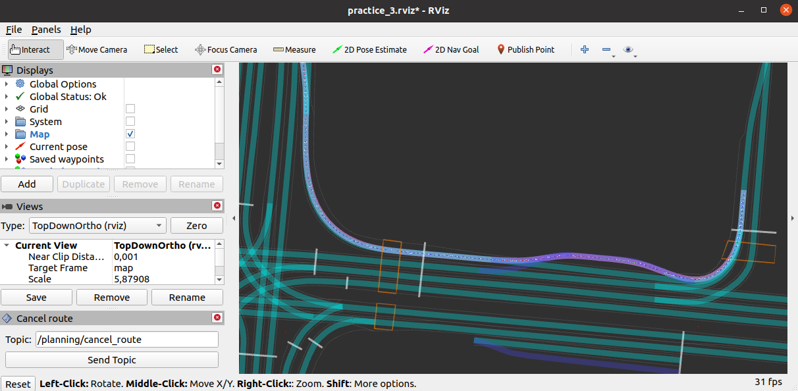

[< Previous practice](../practice_3) -- [**Main Readme**](../README.md) -- [Next practice >](../practice_5)

# Practice 4 - Global planner

In this practice we will be using a map. Map is in [lanelet2](https://github.com/fzi-forschungszentrum-informatik/Lanelet2) format. Your task will be to write a global planner that finds the shortest route from the vehicle's current location to the goal point. The path should then be converted to a `Lane` message so that the `pure_pursuit_follower`, a node you wrote in the previous practice, could use it for path following.

#### New in practice_4 package files
* map files `tartu_demo.osm` and `tartu_large.osm` under `common/data/maps/`
* Lanelet2 map visualization node: `nodes/planning/visualization/lanelet2_map_visualizer.py`

### Expected outcome
* General level understanding of the global planner tasks
* Car is able to follow a path created by global planner


## 1. Preparations

1. Copy your `localizer` and `pure_pursuit_follower` nodes from practice_3
2. Copy the `practice_3.launch` file under the `launch` folder and edit it
   - replace references inside the file from `practice_3` to `practice_4`
   - keep reference to `practice_3.rviz` file
4. On top add an argument `lanelet2_map_name` with a default value of `tartu_demo.osm`
5. Add the `lanelet2_map_visualizer` node to the launch file and add param `lanelet2_map_name`
6. Find where the rosparam file `localization.yaml` is loaded and add at the end a namespace `localization`

```
<rosparam command="load" file="$(find practice_4)/config/localization.yaml" ns="localization" />
```

##### Validation
* `roslaunch practice_4 practice_3.launch lanelet2_map_name:=tartu_large.osm`
* place the start point close to your loaded path - "bicycle" should start following the path as in practice_3,
* additionally, we should see the loaded map. The map is currently used only for visualization.




## 2. Create a gobal planner node and get the goal point

This node makes it possible to plan a path on the map. So, instead of loading the path from the waypoints file, we can select any destination on the map, and the global planner will create the path from the current location to the entered goal point.

##### Instructions
1. Create a new file `lanelet2_global_planner.py` under `/nodes/planning/global`
2. When creating the node follow the class based structure from previous practice.
3. Add lanelet2 map loading; you can use `lanelet2_map_visualizer` node as an example
   - import necessary classes from the lanelet2 library
   - read in necessary ros parameters from `localization.yaml` and `lanelet2_map_name` coming from launch file
   - add the code that loads the [lanelet2 map](./nodes/planning/visualization/lanelet2_map_visualizer.py#L46-57)
4. Create a subscriber and the callback that will get the goal point. Goal point will be entered on the map using a button in rviz with a purple arrow: `2D Nav Goal`
   - The goal point will be published to topic: `/move_base_simple/goal`, type: `geometry_msgs/PoseStamped`
   - add [loginfo](https://wiki.ros.org/rospy_tutorials/Tutorials/Logging) message informing that the goalpoint has been received. 
   - In log message good practice is to start with the node name that creates the log and it might be useful to print out also the coordinates, for example:

```
# All these imports from lanelet2 library should be sufficient
import lanelet2
from lanelet2.io import Origin, load
from lanelet2.projection import UtmProjector
from lanelet2.core import BasicPoint2d
from lanelet2.geometry import findNearest


# loginfo message about receiving the goal point
rospy.loginfo("%s - goal position (%f, %f, %f) orientation (%f, %f, %f, %f) in %s frame", rospy.get_name(),
                    msg.pose.position.x, msg.pose.position.y, msg.pose.position.z,
                    msg.pose.orientation.x, msg.pose.orientation.y, msg.pose.orientation.z,
                    msg.pose.orientation.w, msg.header.frame_id)

```

5. Create a new launch file for practice_4
   - create a new launch file named `practice_4.launch` as a copy from `practice_3.launch`
   - replace the `waypoint_loader` node with `lanelet2_global_planner` node and make sure it gets the parameter `lanelet2_map_name`
   - replace reference from `practice_3.rviz` to `practice_4.rviz`

###### Validation
* run `roslaunch practice_4 practice_4.launch`
* Test also by adding the goal point - purple arrow with `2D Nav Goal` written next to it.
* Everything should run with no errors, and your message about receiving the goal should be displayed in the console.


Output loginfo messages:
```
[INFO] [1707312819.916352]: /lanelet2_global_planner - goal position (-1.027190, -40.500565, 0.000000) orientation (0.000000, 0.000000, -0.760734, 0.649064) in map frame
[INFO] [1707312907.073692]: /lanelet2_global_planner - goal position (4.622345, -35.071140, 0.000000) orientation (0.000000, 0.000000, 0.619234, 0.785206) in map frame
```

## 3. Find the route on lanelet2 map

As a next step, we need to implement the logic of creating the global plan (path from start to goal point). Obviously, We need the current pose and goal points available to do that.

There is one aspect where we will make things a bit simpler. Namely, the current_pose and goal point can be in the middle of the lanelet. It would be nice to clip these excess parts (from start and end) when creating a global path, but as the `findNearest` function in lanelet2 python api returns the whole lanelets then let's skip it for now.
 
To find a route with lanelet2 library traffic rules object and routing graph needs to be created first - [see example here](https://github.com/fzi-forschungszentrum-informatik/Lanelet2/blob/master/lanelet2_examples/scripts/tutorial.py#L215). General overview about [lanelet2 routing](https://github.com/fzi-forschungszentrum-informatik/Lanelet2/tree/master/lanelet2_routing). The following code lines can be used:

```
# traffic rules
traffic_rules = lanelet2.traffic_rules.create(lanelet2.traffic_rules.Locations.Germany,
                                          lanelet2.traffic_rules.Participants.VehicleTaxi)
# routing graph
self.graph = lanelet2.routing.RoutingGraph(self.lanelet2_map, traffic_rules)
```

##### Instructions
1. Generate traffic rules and routing graph
2. Create the subscriber to the `/localization/current_pose` message, type: `geometry_msgs/PoseStamped`
3. Convert current_pose and goal point to lanelet2 geometry type of `BasicPoint2d`

```
self.current_location = BasicPoint2d(msg.pose.position.x, msg.pose.position.y)
```

4. [findNearest](https://github.com/fzi-forschungszentrum-informatik/Lanelet2/blob/master/lanelet2_python/python_api/geometry.cpp#L26) from lanelet2.geometry can be used to find lanelets closest to points, see code below.
5. `getRoute()`, `shortestPath()` and `getRemainingLane()` from lanelet2 [python api routing](https://github.com/fzi-forschungszentrum-informatik/Lanelet2/blob/master/lanelet2_python/python_api/routing.cpp) part can be useful.
6. Add a warning message `logwarn` if no route has been found after entering the goal point. If there is no route then None is returned.

```
# get start and end lanelets
start_lanelet = findNearest(self.lanelet2_map.laneletLayer, self.current_location, 1)[0][1]
goal_lanelet = findNearest(self.lanelet2_map.laneletLayer, self.goal_point, 1)[0][1]
# find routing graph
route = self.graph.getRoute(start_lanelet, goal_lanelet, 0, True)

# find shortest path
path = route.shortestPath()
# this returns LaneletSequence up to a point where lane change would be necessary
path_no_lane_change = path.getRemainingLane(start_lanelet)
```

##### Validation
* run `roslaunch practice_4 practice_4.launch`
* Try to add a goal point where it is impossible to reach and see your warning message in the console
* Everything should run with no errors


## 4. Convert lanelets to path

We have now a route (`path_no_lane_change` from code exampe) consisting of lanelets (LaneletSequence), but we need to convert it to message type `autoware_msgs/Lane` and publish it to a topic `global_path`, so the `pure_pursuit_follower` would be able to subscribe to it and do its job.

1. convert lanelet sequence to waypoints - make it a separate function. Additionally:
   - Previously acquired LaneletSequence is iterable, so just use for loop to go over it and get the individual lanelets
   - check if lanelets have attribute `speed_ref`, if yes use it for waypoint speed.
   - Speeds from the map `speed_ref` are in **km/h**, but in the messages **m/s** should be used as stated in the message definition. Do the conversion.
   - Add parameter `speed_limit`, which should also be an argument in the launch file with default value of 40km/h. The speed from `speed_ref` should never exceed this limit and if lanelet does not have `ref_speed` then `speed_limit` should be used instead
   - waypoints should be extracted from `lanelet.centerline` (again it is iterable and gives you points where coordinates can be accessed with point.x, point.y etc.), hint: end point of a lanelet and start point of the following lanelet overlap - it should not be like that in the path you are going to publish
   - So iterate over LaneletSequence, and then over lanelet.centerline to get the points. For every point you should create a Waypoint (autoware_msgs/Waypoint) and fill in the following (see code below). Waypoints should be collected into list.

```
if 'speed_ref' in lanelet.attributes:
    speed = float(lanelet.attributes['speed_ref'])
```

```
waypoint = Waypoint()
waypoint.pose.pose.position.x = point.x
waypoint.pose.pose.position.y = point.y
waypoint.pose.pose.position.z = point.z
waypoint.twist.twist.linear.x = speed
```

2. Create a publisher and publish waypoints into topic `global_path`, it should be [latched topic](https://wiki.ros.org/rospy/Overview/Publishers%20and%20Subscribers#rospy.Publisher_initialization).  I suggest creating additional function for waypoint publishing that is called within the callback. It makes the code more modular and has better overview.
   - `global_path` should be type [autoware_msgs/Lane](https://github.com/streetdrone-home/Autoware/blob/master/ros/src/msgs/autoware_msgs/msg/Lane.msg) and its attribute waypoints is list of Waypoints.
   - `frame_id` should come frome `/config/planning.yaml` file, parameter `output_frame`
   - timestamp should be added

```
lane = Lane()        
lane.header.frame_id = self.output_frame
lane.header.stamp = rospy.Time.now()
lane.waypoints = waypoints
self.waypoints_pub.publish(lane)
```

##### Validation
* run `roslaunch practice_4 practice_4.launch`
* Everything should run without errors. See what happens when the car reaches the end of the path!


## 5. Clear the path when the goal is reached

1. There is a parameter in planning.yaml called `distance_to_goal_limit` - add it to the node
2. Use it to clear the path (publish empty path - empty list of waypoints) when the car is within that distance of the goal point.
   - Choose the correct callback to place it.
   - Assumes that the goal point is stored
3. Add a loginfo message that the goal is reached.
4. run `roslaunch practice_4 practice_4.launch` - see what happens when the goal is reached.
   - Something goes wrong in the pure_pursuit_follower!?
   - It seems that it can not handle receiving the empty path message
5. Fix the problem in `pure_pursuit_follower`
   - when empty path is received you need to stop the car and only option is to use `vehicle_cmd`
   - what should be publihsed within the vehicle_cmd? What will make vehicle stop and not turn?
   - One way of solvin it: when path and distance to velocity interpolator are first initialized they are set to None. When empty path is received they should be again set to None and this should be appropriately handled in the `current_pose_callback`

##### Validation
* run `roslaunch practice_4 practice_4.launch`
* Everything should run without errors.
* When the car approaches the end of the path, there should be a log info message, and the car should gradually come to a full stop. It can't be stopped immediately bcause there are deceleration limits in the `bicycle_simulator`